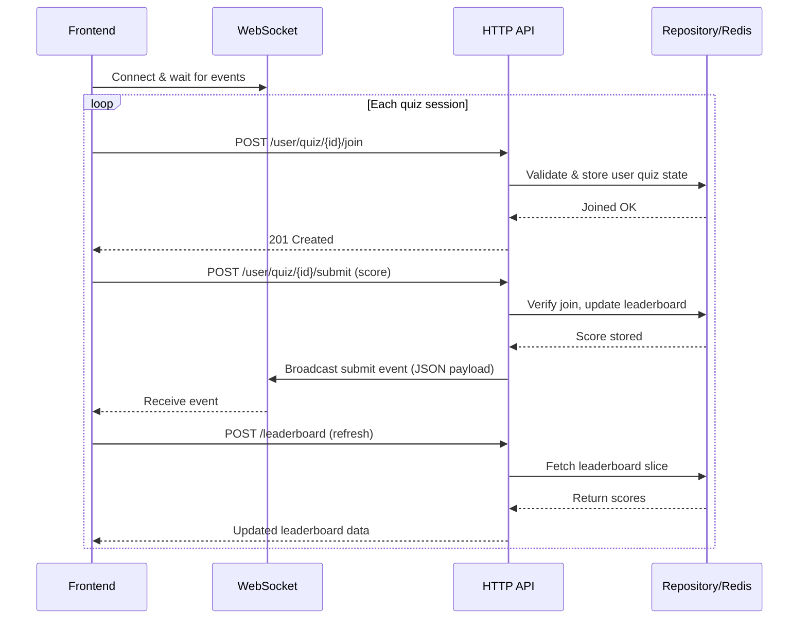

# System Architecture

1. [Architecture Diagram](#architecture-diagram)
2. [Component Description](#component-description)
3. [Data Flow (Join → Submit → Leaderboard)](#data-flow-join--submit--leaderboard)
4. [Websocket & Quiz Sequence](#websocket--quiz-sequence)
5. [Design Trade-offs](#design-trade-offs)
6. [Integration Notes](#integration-notes)

## Architecture Diagram
```mermaid
flowchart LR
    subgraph Client Apps
        FE[Web / Mobile Frontend]
    end
    subgraph Server
        API[HTTP API (Go + Gorilla/mux)]
        WS[WebSocket Handler]
        Repo[Repositories Layer]
    end
    subgraph Redis
        SortedSet[(Sorted Set Leaderboard)]
        UserState[(User Quiz State)]
    end

    FE -- REST (join/submit/leaderboard) --> API
    FE <-- WebSocket events --> WS
    API --> Repo
    WS --> Repo
    Repo --> SortedSet
    Repo --> UserState
    FE -- Auth JWT --> API
```

## Component Description
| Component | Responsibility |
|-----------|----------------|
| **Client Apps** | Authenticate users, call REST endpoints, listen to websocket events, refresh leaderboard/UI. |
| **HTTP API** | Hosts `/user/quiz/{id}/join`, `/user/quiz/{id}/submit`, `/leaderboard`, `/health` with JWT validation. |
| **WebSocket Handler** | Manages realtime connections, broadcasts quiz submissions, enforces heartbeat ping/pong. |
| **Repositories Layer** | Encapsulates Redis access (join validation, score submission, leaderboard queries). |
| **Redis Sorted Set** | Leaderboard store (`emu-game:scores`) with ordered scores. |
| **Redis User State** | Tracks current quiz for each user to enforce single-active-quiz rule. |

## Data Flow (Join → Submit → Leaderboard)
1. **Join**: Frontend POSTs `/user/quiz/{quizID}/join`. API verifies JWT and existing quiz state, then records membership in Redis.
2. **Submit**: Frontend POSTs `/user/quiz/{quizID}/submit` with score. API confirms membership, `ZADD`s the score, then broadcasts over websocket.
3. **Event**: Clients receive websocket notification and trigger a leaderboard refresh.
4. **Leaderboard**: `/leaderboard` fetch returns the requested slice via sorted-set query.

## Websocket & Quiz Sequence


## Design Trade-offs
### 1. WebSocket notification vs. full leaderboard payload
| Option | Pros | Cons |
|--------|------|------|
| Event ping + REST refresh *(current)* | Low WS bandwidth, reuse pagination/filters, clients fetch only what they need | Requires extra HTTP request per event |
| Push full leaderboard via WS | Immediate data, no extra HTTP call | High bandwidth, difficult to respect client-specific pagination, heavier server CPU |

### 2. Redis sorted sets for leaderboard
| Option | Pros | Cons |
|--------|------|------|
| Redis sorted set *(current)* | Automatic ordering, atomic updates, simple infra, O(log N + M) pagination | Depends on Redis availability/backups |
| SQL table with ORDER BY | Familiar, transactional | Requires indexes, heavier queries for top-N, more operational overhead |

### 3. One quiz per user constraint
| Option | Pros | Cons |
|--------|------|------|
| Single active quiz *(current)* | Simplifies validation/state, avoids conflicting submits | Users can’t play multiple quizzes concurrently |
| Multi-quiz support | Flexible for power users | Requires per-quiz session tracking, more complex validation |

### 4. WebSocket fan-out via Redis Pub/Sub
| Option | Pros | Cons |
|--------|------|------|
| Redis Pub/Sub *(current)* | Enables multiple server instances to share events with minimal setup, low latency | Messages aren’t durable; consumers must stay connected, and Redis availability becomes a dependency |
| Dedicated message bus (Kafka/NATS) | Durable, replayable events, strong ordering | More operational overhead, may be overkill for small workloads |

## Integration Notes
### Authentication
All `/user/quiz/...` endpoints expect `Authorization: Bearer <jwt>` where the `sub` claim represents the user. Middleware injects the subject into the request context for downstream handlers.

### Join Quiz (`POST /user/quiz/{quizID}/join`)
- Body: `{}` (quiz ID from path).  
- Enforces single active quiz: rejoining the same quiz or another quiz returns `400`.  
- Backend stores membership with expiration to clear abandoned sessions.

### Submit Quiz (`POST /user/quiz/{quizID}/submit`)
- Body: `{"score": <number>}`.  
- Requires a prior join; otherwise returns `400`.  
- On success, score stored in Redis sorted set and event broadcast via websocket.  
- Frontends should refresh the leaderboard (or apply targeted updates) after receiving the event.

### Leaderboard (`POST /leaderboard`)
- Body: `{"from": <offset>, "limit": <count>}`.  
- Returns sorted JSON array. Clients typically call this on load and after websocket events.

### Websocket (`GET /ws`)
- Push-only channel broadcasting JSON events like `{"event":"submit_quiz","user_id":"...","quiz_id":"...","score":123}`.
- Server sends periodic pings; clients must reply with pongs to keep connections alive.  
- Use a single persistent connection per client and reconnect if closed.
